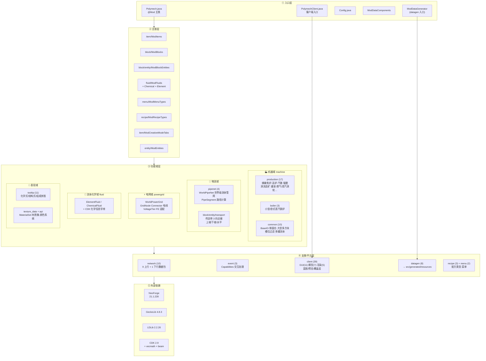
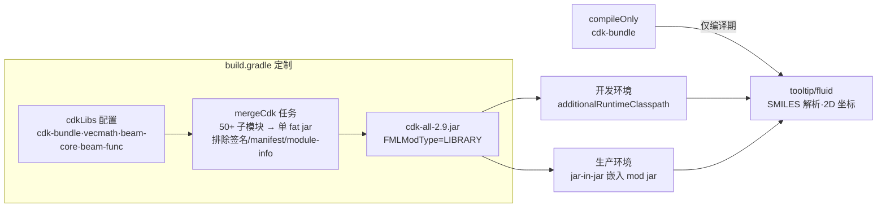

# Poly Mech 代码仓库结构分析

> 生成日期: 2026-06-29 · 模组: **Poly Mech** (`poly_mech`) · Minecraft 1.21.1 / NeoForge 21.1.228 / Java 21

## 1. 概览统计

| 类别 | 数量 |
|---|---|
| Java 源文件 | 187 |
| 顶层 Java 包 | 20 |
| 纹理资源 (`textures`) | 197 |
| 手写模型 (`models`) | 50 |
| Geo (GeckoLib) 模型 | 9 |
| Geo 动画 | 11 |
| 化学/颜色配置文件 | 5 |
| 数据生成产物 (`src/generated`) | ~1 574 (assets 1266 + data 297) |
| 网络数据包 | 10 |

## 2. 目录树

```
polymech-template-1.21.1/
├── src/
│   ├── main/
│   │   ├── java/com/mss/polymech/            ← 187 个 Java 文件
│   │   │   ├── Polymech.java                 ← @Mod 主类（注册总入口）
│   │   │   ├── PolymechClient.java           ← 客户端入口
│   │   │   ├── Config.java                   ← NeoForge 配置
│   │   │   ├── ModDataComponents.java        ← 数据组件
│   │   │   ├── ModDataGenerator.java         ← 数据生成入口
│   │   │   ├── api/            (7)   材质/管道类型等扩展接口
│   │   │   ├── block/          (15)  管道·传送带 + block/entity/transport
│   │   │   ├── client/         (39)  GUI·模型·渲染·输入处理·蓝图预览
│   │   │   ├── datagen/        (8)   配方/战利品/标签/模型/双语言 Provider
│   │   │   ├── entity/         (1)   实体注册
│   │   │   ├── event/          (3)   能力注册·交互处理·客户端事件
│   │   │   ├── fluid/          (10)  元素流体/化学流体/流体单元
│   │   │   ├── item/           (14)  物品（扳手·蓝图·流体单元·线缆卷…）
│   │   │   ├── ldlib/          (1)   LDLib 插件
│   │   │   ├── machine/        (35)  生产机器(17)·锅炉(3)·通用IO(10)
│   │   │   ├── menu/           (2)   菜单类型
│   │   │   ├── network/        (10)  数据包
│   │   │   ├── pipenet/        (4)   世界级流体管网
│   │   │   ├── powergrid/      (11)  电网（节点·电线·电压层级·FE适配）
│   │   │   ├── recipe/         (3)   机器配方类型/序列化
│   │   │   ├── texture_data/   (5)   材质集/颜色加载器
│   │   │   ├── tooltip/        (11)  化学式/结构式/组成饼图 tooltip
│   │   │   └── util/           (3)   路径计算·Geo模型工具
│   │   ├── resources/
│   │   │   ├── assets/poly_mech/
│   │   │   │   ├── textures/   (197) 机器·管道·材质集·GUI·物品
│   │   │   │   ├── models/     (50)  block/item 手写模型模板
│   │   │   │   ├── geo/        (9)   GeckoLib 方块模型
│   │   │   │   ├── animations/ (11)  机器动画
│   │   │   │   ├── config/     (5)   colors/元素色/离子式/SMILES/聚合物式
│   │   │   │   └── blockstates/(2)
│   │   │   └── poly_mech.mixins.json   ← mixin 配置（当前为空）
│   │   └── templates/META-INF/neoforge.mods.toml  ← 构建时展开占位符
│   └── generated/resources/    ← 数据生成输出
│       ├── assets/poly_mech/   (1266) 模型·方块状态·语言 en_us/zh_cn
│       └── data/               (297)  配方·战利品表·进度·标签
├── run/          ← 开发用游戏实例（saves/「新的世界」·logs·crash-reports）
├── build/        ← Gradle 构建输出（含 ldlib2-src、libs 产物）
├── gradle/       ← Gradle Wrapper
├── software/     ← GeckoLib 动画类源码副本（2 个类，参考/修补用）
├── diag/         ← 化学数据提取脚本（GT 流体 TSV 提取等）
├── tools/        ← （空目录）
├── .qoder/skills/neoforge-modding/  ← AI 辅助技能文档
├── .github/workflows/build.yml       ← CI（push/PR 自动构建）
├── build.gradle / settings.gradle / gradle.properties
└── verify_init.gradle  ← 临时脚本：verifyPolymers 聚合物结构式验证任务
```

## 3. 分层架构图



## 4. CDK 化学库的定制打包流程



> 设计动机：`cdk-bundle` 是空聚合包，类分散在 50+ 子模块中；散装进入 dev 类路径会因包名重叠被 PackageTracker 剔除导致 `ClassNotFoundException`，故合并为单一 fat jar，且编译期与运行期分离。

## 5. 数据流与职责划分

| 层 | 职责 | 关键类型 |
|---|---|---|
| 入口层 | 挂载生命周期事件、串联注册 | `Polymech` / `PolymechClient` |
| 注册层 | 通过 `DeferredRegister` 注册游戏内容 | `ModItems` / `ModBlocks` / `ModBlockEntities` / `ModFluids` … |
| 功能域层 | 模组玩法本体 | `machine` / `pipenet` / `conveyor` / `powergrid` / `fluid` |
| 网络层 | C2S 配置与放置、S2C 电网同步 | `network/*Packet` (10) |
| 客户端层 | UI、GeckoLib 模型与动画、放置预览、蓝图系统 | `client/gui` / `client/model` / `client/renderer` |
| 数据生成 | 配方/战利品/标签/模型/双语言自动生成 | `datagen/*Provider` → `src/generated` |

## 6. 值得注意的点

1. **世界级网络系统**：`pipenet`（流体）与 `powergrid`（电力）都实现了全局网络 + 路径计算的模式，能力通过 NeoForge `RegisterCapabilitiesEvent` 暴露。
2. **大型多方块机器的统一抽象**：`MachineRegistry`/`MachineRegistrar` + 主方块/侧面仓(IO)分离，能力按面配置 (`SideConfig`) 过滤。
3. **化学内容深度集成**：流体带元素组成/分子式，tooltip 显示结构式与组成饼图，依赖 CDK 库并经过定制打包。
4. **材质集系统** (`texture_data` + `api/material`)：管道/传送带/锭类物品按材质复用纹理模板，颜色由 `config/*.json` 驱动。
5. **蓝图系统**：客户端有专门的 `Blueprint*` 类（输入处理、HUD 覆盖层、预览状态）。
6. **mixin 配置已挂载但为空**：`poly_mech.mixins.json` 的 `mixins: []`，尚无实际 mixin 类。
7. **临时文件**：`verify_init.gradle`（注释声明验证后删除）、`machine/power` 与 `machine/powerblock` 与 `client/screen`、`tools/` 为空目录，疑似重构残留。
8. **CI**：`.github/workflows/build.yml` 在 push/PR 时用 JDK 21 + Gradle 构建。
